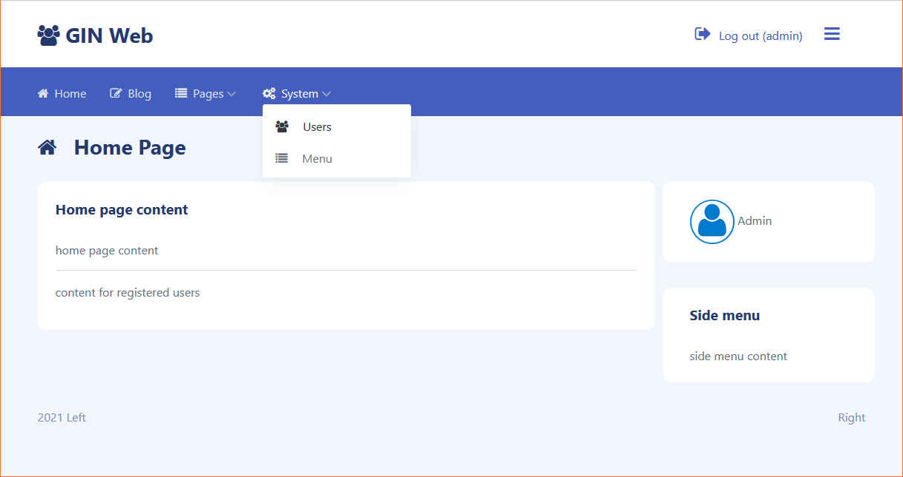

> Simple web project on golang with [gin](https://github.com/gin-gonic/gin)

[](#title)

### Project setup
> copy project to GOPATH/src directory

> copy config file [config.empty.json](config.empty.json) to config.json

> set connection to your mysql server in config.json db section

> create mysql database and import dump from [gin.sql](gin.sql)

> gin.sql dump comes with two users "admin" and "user", both has password "qwe"

### Install dependencies
```bash
go get
```

### Build
```bash
go build
```

### Bootstrap 5 theme
Mazer: https://github.com/zuramai/mazer
